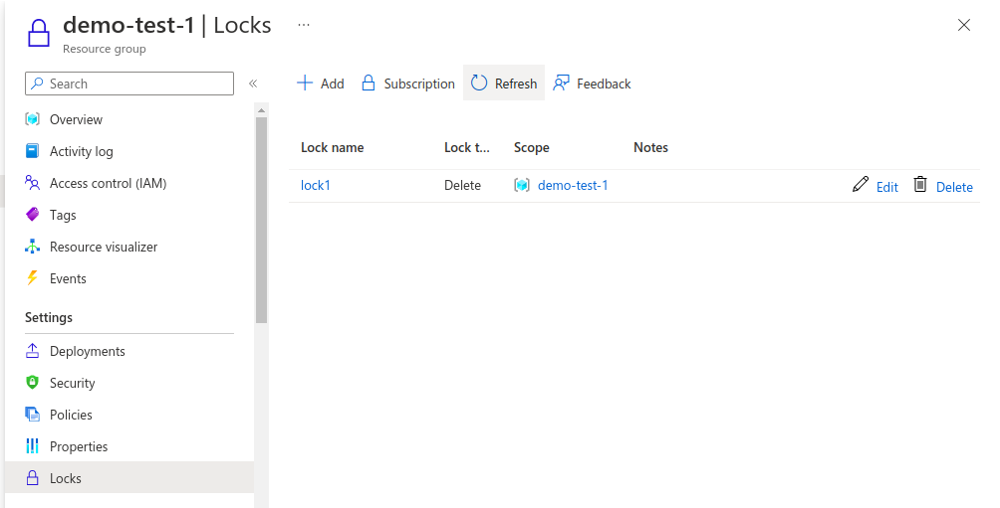
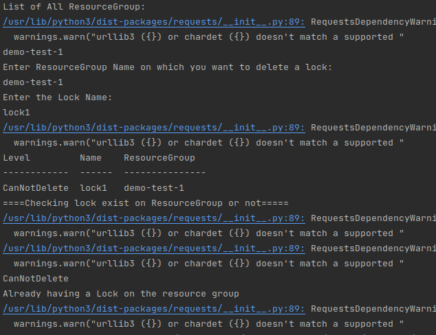
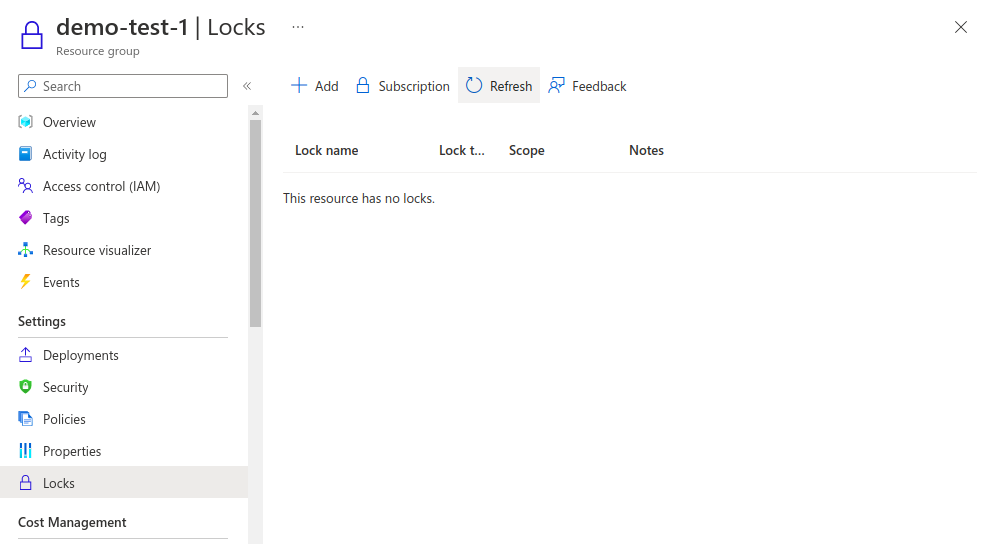
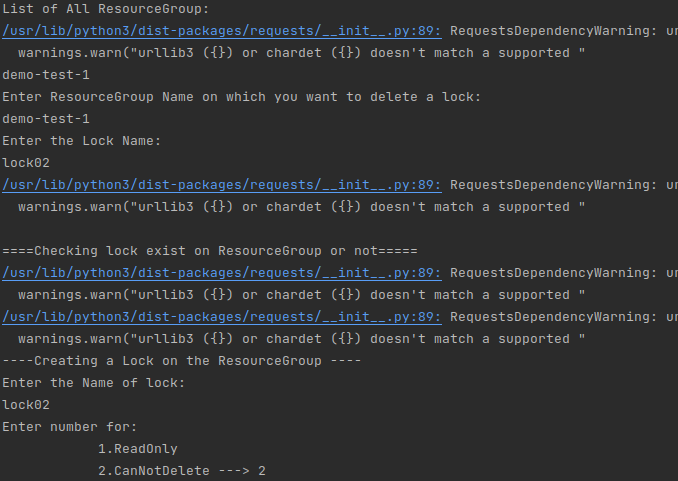
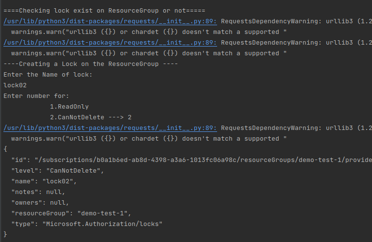
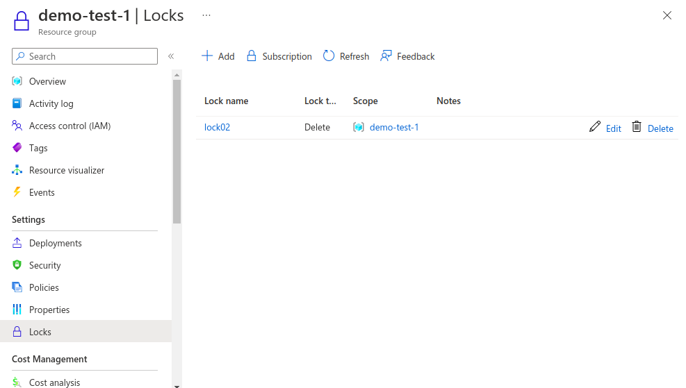

## Description

Here, In this template we will delete the Resource Group of Azure using the shell script.

---

#### Pre-requisite

* AZ Account
* Azure CLI

---
#### Note
While deleting the resource group and running the script you will get all the available locks  in `lock-type.txt` which will be present only at the time of running the script.

---

### Steps:-
1. Login into AZ account using `az login` or `az login --tenant <TENANT-ID>`
2. Change the permission of the file `chmod a+x delete-lock-resource-group.sh`
3. Go to the terminal and run the command `./delete-lock-resource-group.sh`

---

### Outputs
* Here, In this output it's showing the lock on the Resource group :

* Here, In this output we are deleting the existing lock on the resource group :

* Deleting the lock from the resource group checking on Azure Cloud:

* Creating the lock on the resource group, if doesn't exist:

* Created lock again , showing on Azure Cloud :

---
